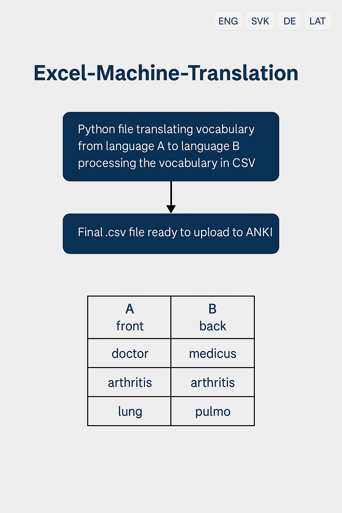

# Excel-Machine-Translation

<p align="center">
  
</p>

## Description
A Python script for machine translation of vocabulary lists from one language to another, processing CSV files (UTF-8 encoded). The output CSV is ready to upload to ANKI (column A as front, column B as back).

## Features
- Machine translation of vocabulary lists for healthcare students or students of Interpreting and Translating
- Minimal hallucinations and corrections needed
- Direct CSV upload to ANKI after corrections (e.g., front + back + tag)
- Significant time savings compared to manual translation
- Supports VLOOKUP for future database creation

## Requirements
- Python 3.x
- pandas
- translate

## Usage
1. Prepare your input CSV file as `input.csv` with columns for source language (e.g., 'German').
2. Run the script:
   ```
   python main.py
   ```
3. The translated output will be saved to `output.csv`.

## TO-DO-LIST
- Create column C as tags for ANKI, using the same tag for each row indicated as input
- Input default and target language

## Contributing
Contributions are welcome! Please open an issue or submit a pull request.